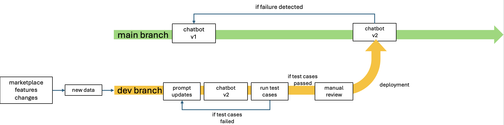

## Update Process
The update process workflow is as such:
1. Markeplace features evolve/changes in contexts or policies
2. New data collected and fetch changes from branch
3. Update prompts with new changes
4. New chatbot version created
5. New chatbot version undergoes rigorous testing and edge case testing using the "Golden Test" design in test-cases.json (CI pipeline)
6. If new version found to perform worse in its responses, it revert back to prompt updating stage for further finetuning. 
7. If new version found to have an improvement, model is passed on to human moderators for a manual check and approval before merging with the main branch (CD pipeline)
8. Main branch stays online and active throughout the process and any failures detected after the deployment of the new version(eg. through user feedbacks) will result in a rollback to the previous stable chatbot version.

## Workflow Diagram

